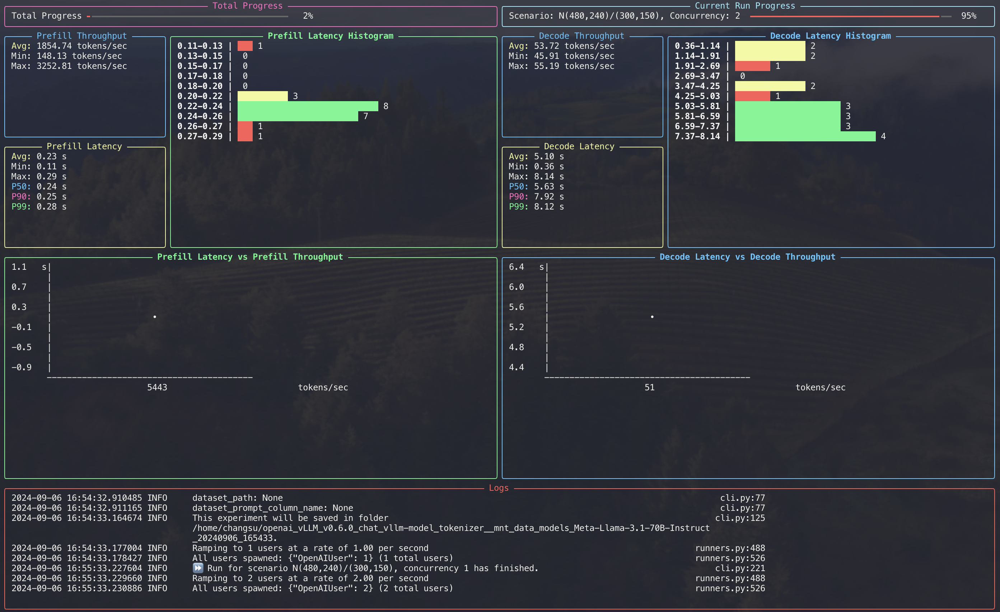

# GenAI Bench


**Unified, accurate, and beautiful LLM Benchmarking**

[](https://pypi.org/project/genai-bench/)
[](https://github.com/sgl-project/genai-bench)
[](https://github.com/sgl-project/genai-bench)
[](https://github.com/sgl-project/genai-bench)
[](https://github.com/sgl-project/genai-bench/blob/main/LICENSE)

---

## What is GenAI Bench?

Genai-bench is a powerful benchmark tool designed for comprehensive token-level performance evaluation of large language model (LLM) serving systems.

It provides detailed insights into model serving performance, offering both a user-friendly CLI and a live UI for real-time progress monitoring.

## Live UI Dashboard

GenAI Bench includes a real-time dashboard that provides live monitoring of your benchmarks:



## Key Features

- 🛠️ **CLI Tool**: Validates user inputs and initiates benchmarks seamlessly.
- 📊 **Live UI Dashboard**: Displays current progress, logs, and real-time metrics.
- 📝 **Rich Logs**: Automatically flushed to both terminal and file upon experiment completion.
- 📈 **Experiment Analyzer**: Generates comprehensive Excel reports with pricing and raw metrics data, plus flexible plot configurations (default 2x4 grid) that visualize key performance metrics including throughput, latency (TTFT, E2E, TPOT), error rates, and RPS across different traffic scenarios and concurrency levels. Supports custom plot layouts and multi-line comparisons.

## Quick Start

Get started with GenAI Bench in minutes:

```bash
# Install from PyPI
pip install genai-bench

# Run your first benchmark
genai-bench benchmark --help
```

For detailed installation and usage instructions, see our [Installation Guide](getting-started/installation.md).

## Supported Tasks

GenAI Bench supports multiple benchmark types:

| Task | Description | Use Case |
|------|-------------|----------|
| `text-to-text` | Benchmarks generating text output from text input | Chat, QA |
| `text-to-embeddings` | Benchmarks generating embeddings from text input | Semantic search |
| `image-text-to-text` | Benchmarks generating text from images and text prompts | Visual question answering |
| `image-to-embeddings` | Benchmarks generating embeddings from images | Image similarity |

## Documentation Sections

### 🚀 Getting Started

- [Installation](getting-started/installation.md) - Detailed installation guide
- [Task Definition](getting-started/task-definition.md) - Understanding different benchmark tasks
- [Command Guidelines](getting-started/command-guidelines.md) - Command usage guidelines
- [Metrics Definition](getting-started/metrics-definition.md) - Understanding benchmark metrics

### 📖 User Guide

- [Run Benchmark](user-guide/run-benchmark.md) - How to run benchmarks
- [Traffic Scenarios](user-guide/scenario-definition.md) - Understanding traffic scenario syntax
- [Multi-Cloud Authentication & Storage](user-guide/multi-cloud-auth-storage.md) - Comprehensive guide for cloud provider authentication
- [Multi-Cloud Quick Reference](user-guide/multi-cloud-quick-reference.md) - Quick examples for common scenarios
- [Docker Deployment](user-guide/run-benchmark-using-docker.md) - Docker-based benchmarking
- [Excel Reports](user-guide/generate-excel-sheet.md) - Creating Excel reports
- [Visualizations](user-guide/generate-plot.md) - Creating visualizations
- [Upload Results](user-guide/upload-benchmark-result.md) - Uploading results

### 🔧 Development

- [Contributing](development/contributing.md) - How to contribute to GenAI Bench

### 📚 API Reference

- [API Documentation](api/index.md) - Complete API reference and code examples

## Support

If you encounter any issues or have questions, please:

- Check our documentation for detailed guides
- Report issues on our GitHub repository
- Join our community discussions

## License

GenAI Bench is open source and available under the MIT License. 