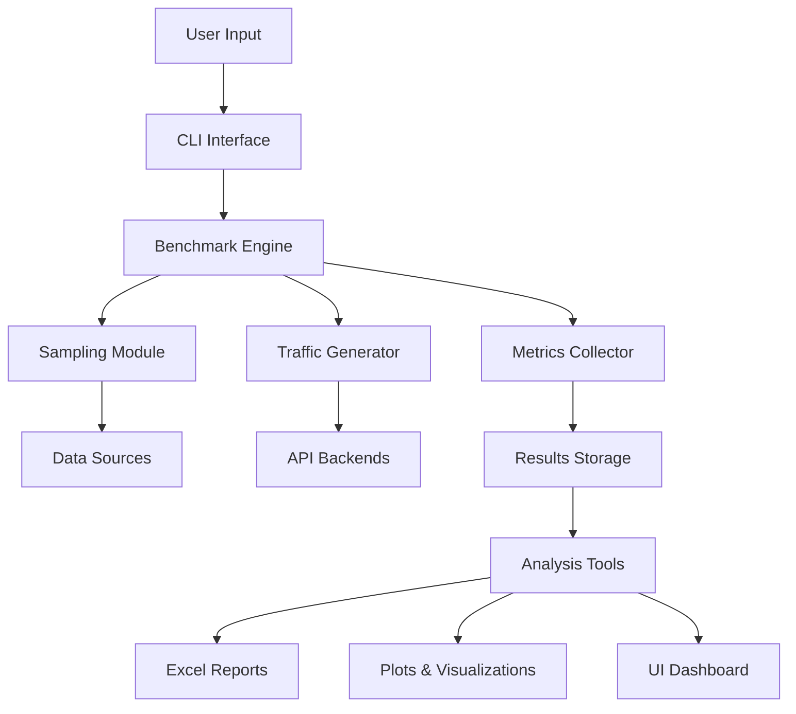
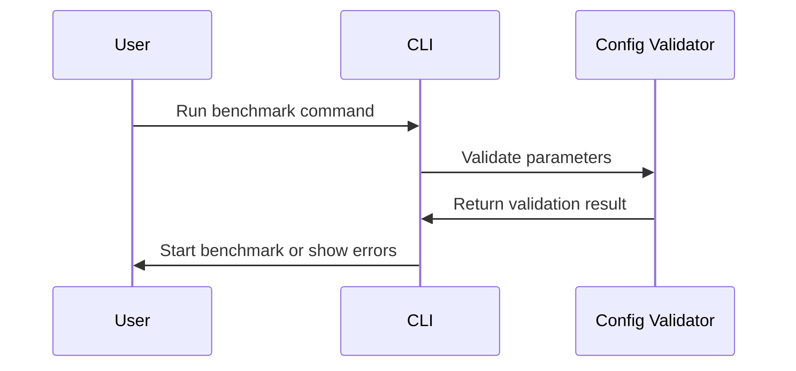
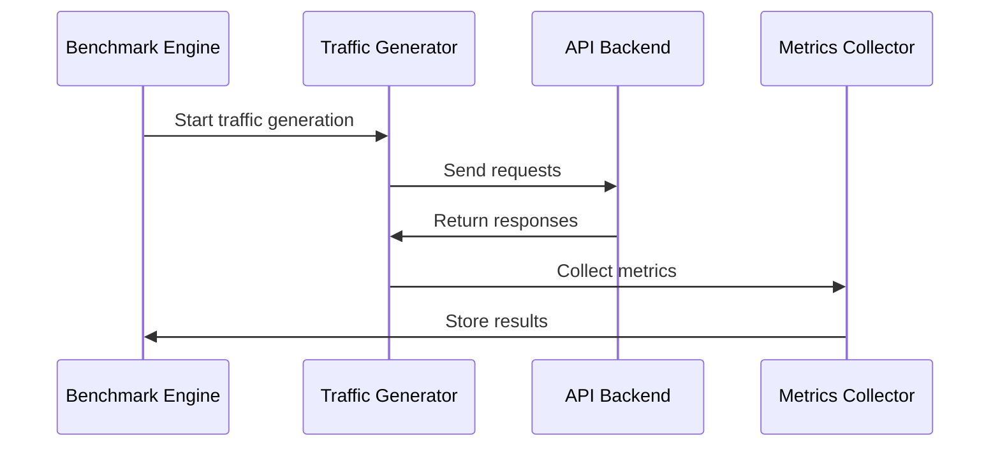
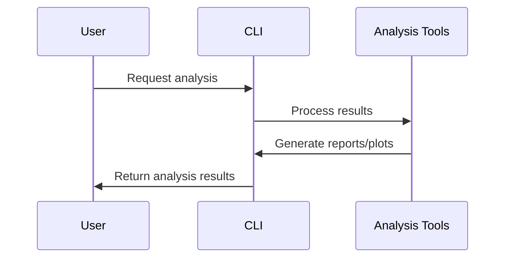

# GenAI Bench Overview

This guide provides a comprehensive overview of GenAI Bench, its architecture, and core concepts.

## What is GenAI Bench?

GenAI Bench is a comprehensive benchmarking tool designed for evaluating the performance of Large Language Model (LLM) serving systems. It provides detailed, token-level performance analysis with both command-line and web-based interfaces.

## Core Architecture

## Key Components

### 1. CLI Interface
The command-line interface provides a unified way to:
- Configure benchmark parameters
- Start and monitor benchmarks
- Generate reports and visualizations
- Manage experiment data

### 2. Benchmark Engine
The core engine orchestrates:
- **Task Management**: Handles different benchmark types (text-to-text, embeddings, etc.)
- **Traffic Generation**: Creates realistic load patterns
- **Metrics Collection**: Gathers performance data at token level
- **Result Processing**: Aggregates and analyzes results

### 3. Sampling Module
Responsible for:
- **Data Loading**: Reads from various data sources
- **Tokenization**: Converts text to tokens for analysis
- **Request Generation**: Creates API requests with proper formatting

### 4. API Backends
Supports multiple LLM serving systems:
- **OpenAI-compatible**: vLLM, OpenAI API, etc.
- **Cohere**: Native Cohere API
- **OCI Cohere**: Oracle Cloud Infrastructure Cohere

## Benchmark Types

### Task Categories

GenAI Bench supports four main task categories:

| Task | Input | Output | Use Cases |
|------|-------|--------|-----------|
| `text-to-text` | Text | Text | Chat, QA, summarization |
| `text-to-embeddings` | Text | Embeddings | Semantic search, similarity |
| `image-text-to-text` | Image + Text | Text | Visual QA, image understanding |
| `image-to-embeddings` | Image | Embeddings | Image similarity, search |

### Traffic Patterns

Different traffic scenarios simulate real-world usage:

- **Constant Load**: Steady request rate for baseline performance
- **Burst Traffic**: Sudden spikes to test system resilience
- **Ramp-up**: Gradually increasing load to find capacity limits

## Performance Metrics

### Single-Request Metrics

These metrics capture performance for individual requests:

| Metric | Description | Formula | Unit |
|--------|-------------|---------|------|
| **TTFT** | Time to First Token | `time_at_first_token - start_time` | seconds |
| **E2E Latency** | End-to-End latency | `end_time - start_time` | seconds |
| **TPOT** | Time Per Output Token | `(e2e_latency - TTFT) / (num_output_tokens - 1)` | seconds |
| **Inference Speed** | Tokens per second | `1 / TPOT` | tokens/second |
| **Input Throughput** | Input processing rate | `num_input_tokens / TTFT` | tokens/second |
| **Output Throughput** | Output generation rate | `(num_output_tokens - 1) / output_latency` | tokens/second |

### Aggregated Metrics

These metrics summarize performance across multiple requests:

| Metric | Description | Formula | Unit |
|--------|-------------|---------|------|
| **Mean Input Throughput** | Average input processing rate | `sum(input_tokens) / run_duration` | tokens/second |
| **Mean Output Throughput** | Average output generation rate | `sum(output_tokens) / run_duration` | tokens/second |
| **Total Tokens Throughput** | Overall token processing rate | `sum(total_tokens) / run_duration` | tokens/second |
| **Requests Per Minute** | Request processing rate | `num_completed_requests / duration * 60` | requests/minute |
| **Error Rate** | Percentage of failed requests | `num_error_requests / total_requests` | percentage |

## Data Flow

### 1. Configuration Phase

### 2. Benchmark Execution

### 3. Analysis Phase

## Key Features

### Real-time Monitoring
- **Live UI Dashboard**: Web-based interface showing real-time progress
- **Rich Logging**: Detailed logs with automatic file output
- **Progress Tracking**: Visual indicators of benchmark status

### Comprehensive Analysis
- **Excel Reports**: Detailed spreadsheets with all metrics
- **Custom Plots**: Flexible visualization with 2x4 grid layouts
- **Multi-experiment Comparison**: Compare results across different runs

### Scalability
- **Distributed Benchmarking**: Run benchmarks across multiple machines
- **Configurable Load**: Adjust traffic patterns and concurrency levels
- **Resource Management**: Efficient memory and CPU usage

## Best Practices

### Benchmark Design
1. **Start Simple**: Begin with basic configurations
2. **Gradual Scaling**: Increase load gradually to find limits
3. **Multiple Scenarios**: Test different traffic patterns
4. **Consistent Environment**: Use same hardware/software for comparisons

### Result Interpretation
1. **Context Matters**: Consider your specific use case
2. **Look for Trends**: Focus on patterns, not single data points
3. **Compare Apples to Apples**: Use consistent parameters
4. **Validate Results**: Run multiple times to ensure consistency

## Next Steps

- Learn about the [Command Line Interface](cli.md) for detailed usage
- Explore [Tasks and Benchmarks](tasks.md) for specific scenarios
- Check out [Results Analysis](analysis.md) for understanding your data
- See [Examples](examples/basic-benchmarks.md) for practical use cases 